<!-- ═══════════════ HEADER ═══════════════ -->
<p align="center">
  
</p>

<p align="center">
  
</p>

<p align="center">
  <a href="https://github.com/PrasastiBaitharu"></a>
  
  
  
</p>

<p align="center">
  <a href="https://linkedin.com/in/prasasti-kumar-baitharu-16960b341"></a>
  <a href="mailto:prasastikumarbaitharu@gmail.com"></a>
  <a href="https://github.com/PrasastiBaitharu?tab=repositories"></a>
</p>

---

## 👨‍💻 About Me

<table>
<tr>
<td width="55%" valign="top">

🎓 **BCA student** passionate about software development and problem solving

💻 I build **full-stack web apps** with modern JavaScript technologies

🌐 Currently focused on the **MERN Stack**, **TypeScript** and backend development

🧠 Sharpening my **DSA** and core CS fundamentals

🤖 Exploring **AI, LLMs & automation**

🌍 Aiming to contribute to **open source**

> ### *Code. Learn. Build. Repeat.* 🔥

</td>
<td width="45%" valign="top">

```js
const prasasti = {
  role: "Full-Stack Developer",
  education: "BCA Student",
  stack: ["MongoDB", "Express",
          "React", "Node.js"],
  languages: ["JavaScript", "TypeScript"],
  learning: ["DSA", "System Design",
             "Docker", "AI / LLMs"],
  openTo: ["Internships", "Open Source",
           "Collaboration"],
  motto: "Always learning, always building 🚀"
};
```

</td>
</tr>
</table>

---

## 🛠️ Tech Stack

<div align="center">

| | |
|:--|:--|
| **🎨 Frontend** |  |
| **⚙️ Backend & DB** |  |
| **💻 Languages** |  |
| **🔧 Tools** |  |

</div>

---

## 📊 GitHub Activity

<p align="center">
  
</p>

<p align="center">
  <b>🟩 Contribution Graph</b><br/><br/>
  
</p>

<!--
  OPTIONAL: self-generated stats card (never breaks, unlike third-party widgets).
  1. Add the workflow file  .github/workflows/metrics.yml
  2. Run it once from the Actions tab
  3. Then uncomment the block below
-->
<!--
<p align="center">
  
</p>
-->

---

## 📚 Learning Roadmap

```mermaid
flowchart LR
    A[TypeScript] --> B[Advanced React]
    B --> C[Node.js & Express]
    C --> D[MongoDB & DB Design]
    D --> E[Auth & Security]
    E --> F[DSA]
    F --> G[System Design]
    G --> H[AI / LLM Apps]
    style A fill:#3178C6,color:#fff
    style B fill:#61DAFB,color:#000
    style C fill:#339933,color:#fff
    style D fill:#47A248,color:#fff
    style E fill:#E3B341,color:#000
    style F fill:#F78166,color:#000
    style G fill:#8957E5,color:#fff
    style H fill:#1F6FEB,color:#fff
```



<p align="center">
  
</p>

---

## 🎯 Goals

| Goal | Focus |
|:--|:--|
| 🚀 **Ship** | Production-ready full-stack applications |
| 🧠 **Think** | Stronger DSA & problem-solving |
| 🔐 **Secure** | Advanced backend security |
| ☁️ **Deploy** | DevOps & cloud deployment skills |
| 🤖 **Innovate** | AI-powered applications |
| 🌍 **Give back** | Open-source contributions |

---

## 🤝 Let's Connect

<p align="center">
  I'm open to <b>internships, collaborations and open-source work</b>.<br/>
  Reach out, and let's build something great together!
</p>

<p align="center">
  <a href="https://linkedin.com/in/prasasti-kumar-baitharu-16960b341"></a>
  <a href="mailto:prasastikumarbaitharu@gmail.com"></a>
  <a href="https://github.com/PrasastiBaitharu"></a>
</p>

<p align="center">
  
</p>

<p align="center">
  ⭐ <b>Thanks for visiting my profile!</b> ⭐
</p>

<!-- ═══════════════ FOOTER ═══════════════ -->
<p align="center">
  
</p>
